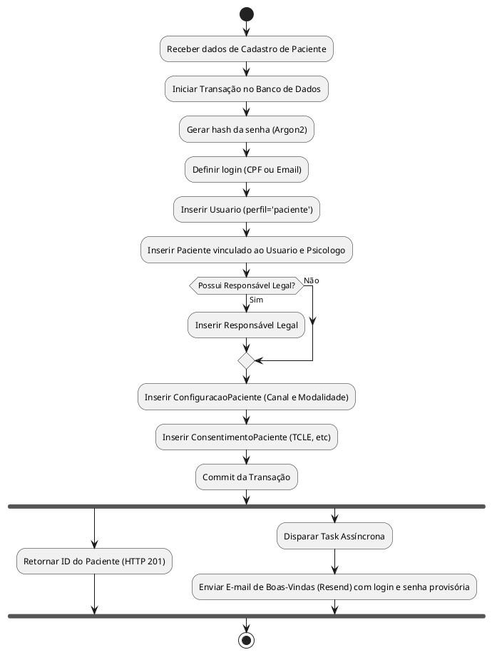
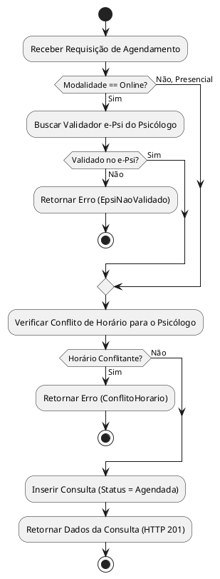

## 2. Diagramas de Atividade

Abaixo estão os diagramas de atividade (UML) para os principais fluxos de negócio do sistema PsiSoft, modelados conforme a implementação atual.

### 2.1 Cadastro de Paciente

### 2.2 Agendamento de Consulta

