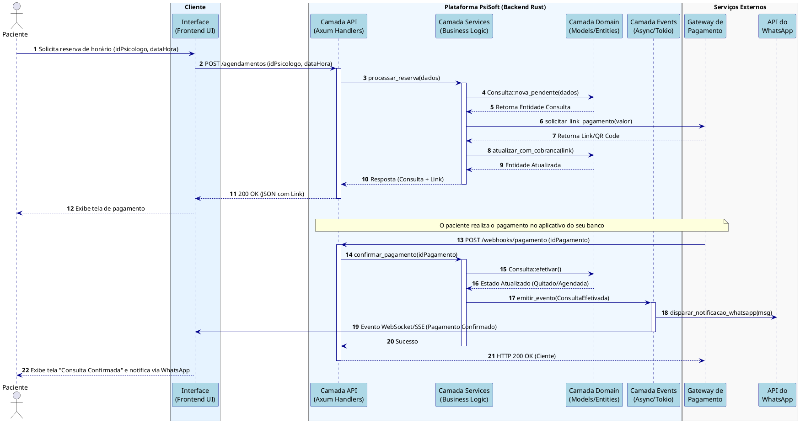

## 2. Modelos de Componentes e Comportamentos (Nível C3)

### 2.1 Diagrama de Sequência de Componentes: Fluxo de Agendamento e Pagamento

A figura abaixo ilustra as interações e trocas de mensagens entre as camadas arquiteturais do sistema (Rust) durante o processo central de reserva de horário e processamento assíncrono de pagamento.

**Justificativa Arquitetural:**
O diagrama demonstra o comportamento dinâmico das camadas da aplicação (`api`, `services`, `domain`, `events`). Optou-se por separar a lógica de negócios na camada `services`, enquanto as regras de estado e validações residem em `domain`. A comunicação com serviços externos (Gateway e WhatsApp) e as notificações em tempo real ocorrem de forma assíncrona, orquestradas pela camada `events` (usando Tokio), otimizando a resposta da API em Axum e evitando bloqueios no fluxo principal.

### Apêndice: Código-Fonte do Diagrama (PlantUML)

*Nota técnica: Este bloco de código serve para manutenção futura da arquitetura pela equipe e pode ser omitido na compilação final do LaTeX.*

