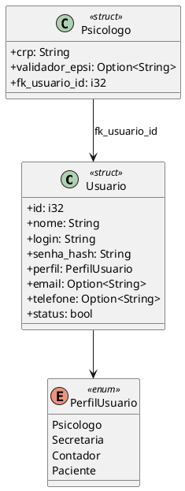
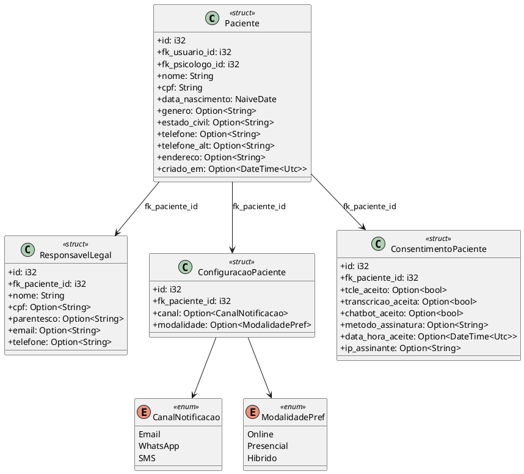
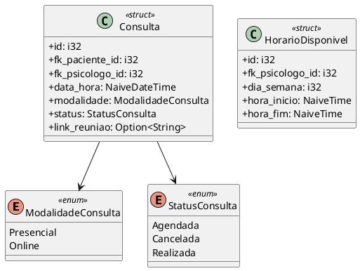
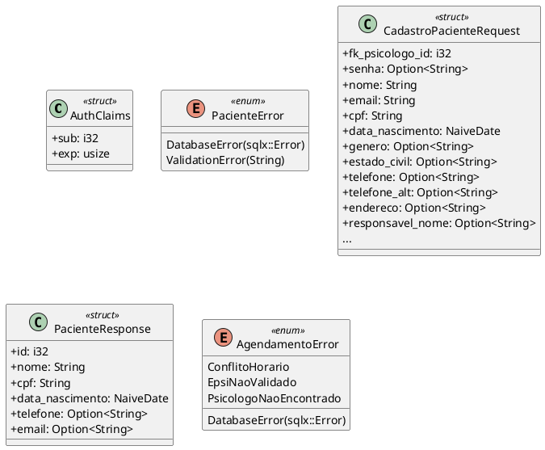

# 4.3 Diagramas de Classes de Implementação

Estes diagramas refletem as estruturas (`structs`) e enumerações (`enums`) da camada de Domínio e Serviços implementadas em Rust, com tipagem estrita (e.g., `String`, `i32`, `NaiveDate`, `Option<T>`).

## Domínio: Usuário (`domain::user`)

## Domínio: Paciente (`domain::paciente`)

## Domínio: Agendamento (`domain::agendamento`)

## Serviços: Autenticação, Paciente e Agendamento (`services::*`)

