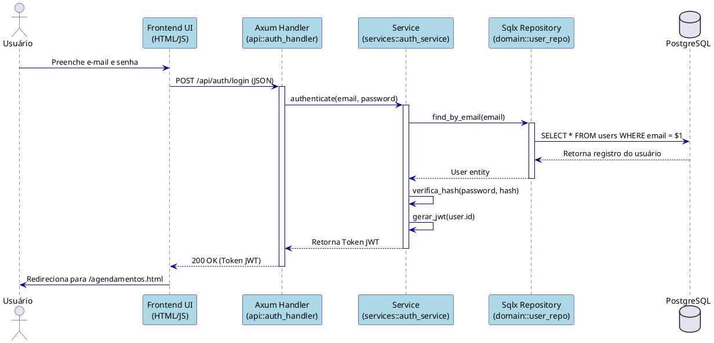
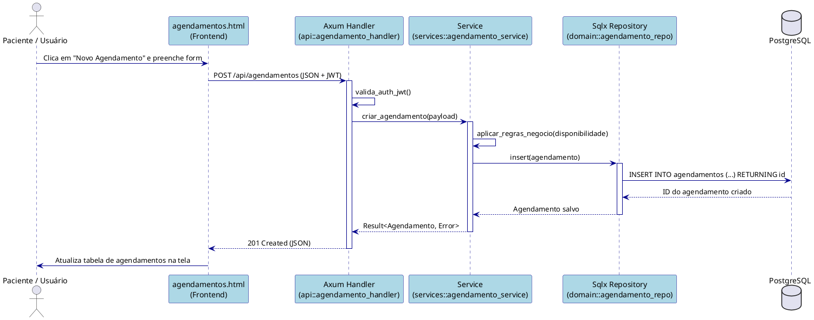

## 4. Diagramas de Sequência (Nível C4)

Este documento descreve os fluxos de implementação detalhados para os principais casos de uso do sistema PsiSoft, mapeando a interação desde a interface do usuário até o banco de dados. A arquitetura de implementação segue o modelo em camadas do Rust: **Axum (Handlers / API)** -> **Service (Lógica de Negócios)** -> **Sqlx (Repositório / Banco de Dados)**.

### 4.1 Fluxo de Autenticação (Login)

Este diagrama detalha o processo de login de um usuário na plataforma.

### 4.2 Fluxo de Novo Agendamento

Este diagrama detalha o processo de criação de um novo agendamento, acionado através da tela `agendamentos.html`.

