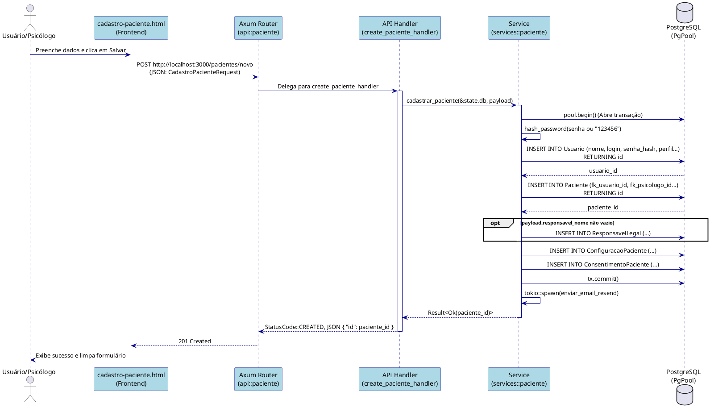
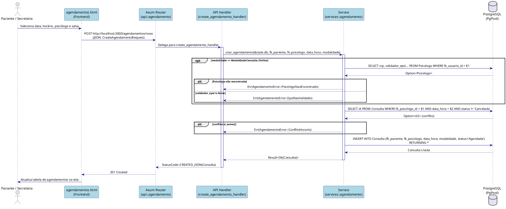

## 4. Diagramas de Sequência (Nível C4)

Este documento descreve os fluxos de implementação detalhados para os principais casos de uso do sistema PsiSoft, mapeando a interação desde a interface do usuário até o banco de dados. A arquitetura de implementação segue o modelo em camadas do Rust: **Axum (Handlers / API)** -> **Service (Lógica de Negócios)** -> **Sqlx (Repositório / Banco de Dados)**.

### 4.1 Cadastrar Paciente

Este diagrama detalha o processo completo de cadastro de um novo paciente, rastreado a partir de `cadastro-paciente.html` invocando a API Rust Axum.

### 4.2 Marcar Agendamento

Este diagrama mapeia rigorosamente a lógica de negócio associada ao agendamento de consultas a partir da interface `agendamentos.html`.

