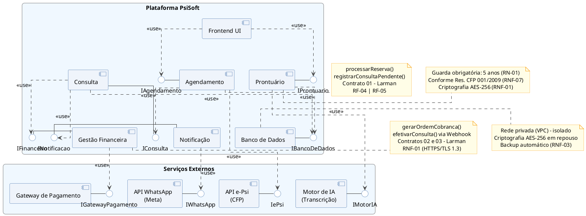

# 3. Arquitetura de Componentes (Nível C3)

## 3.1 Diagrama de Componentes

A figura abaixo apresenta o Diagrama de Componentes do sistema PsiSoft, evidenciando a decomposição lógica da aplicação em módulos de software, suas interfaces fornecidas e requeridas, bem como as integrações com serviços externos necessários ao funcionamento da plataforma.

### Justificativa Arquitetural

A arquitetura foi estruturada seguindo os princípios de baixo acoplamento e alta coesão descritos por Craig Larman em *Applying UML and Patterns*. Cada componente encapsula responsabilidades específicas do domínio de negócio, comunicando-se por meio de interfaces bem definidas.

O componente **Frontend UI** atua como ponto de entrada para os usuários da plataforma, consumindo os serviços de Agendamento e Prontuário. O componente **Agendamento** é responsável pelo gerenciamento de reservas e validações profissionais junto ao Cadastro e-Psi. O componente **Consulta** centraliza o fluxo clínico, integrando-se aos módulos de Gestão Financeira e Notificação para execução dos contratos de operação definidos na análise de requisitos.

A persistência dos dados é realizada por meio do componente **Banco de Dados**, acessado exclusivamente pelos componentes autorizados, garantindo isolamento e rastreabilidade das informações clínicas. O componente **Prontuário** integra-se ao Motor de IA para automatizar a transcrição de atendimentos, enquanto a Gestão Financeira comunica-se com o Gateway de Pagamento para processamento e confirmação de cobranças.

A arquitetura também incorpora requisitos não funcionais críticos, incluindo criptografia AES-256 para proteção de dados sensíveis, comunicação segura via HTTPS/TLS 1.3 e armazenamento de prontuários em conformidade com as resoluções do Conselho Federal de Psicologia.

---

## Apêndice: Código-Fonte do Diagrama (PlantUML)

**Nota técnica:** Este bloco de código serve para manutenção futura da arquitetura pela equipe e pode ser omitido na compilação final do LaTeX.

